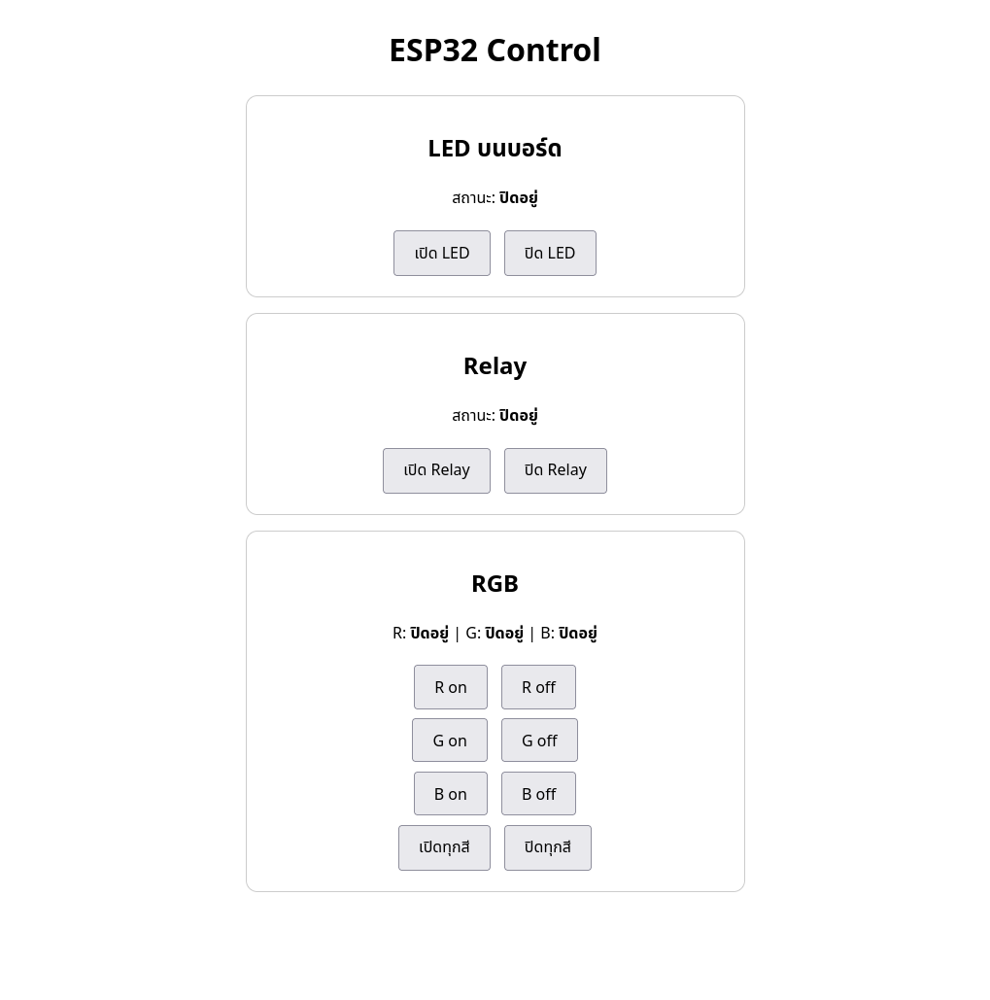
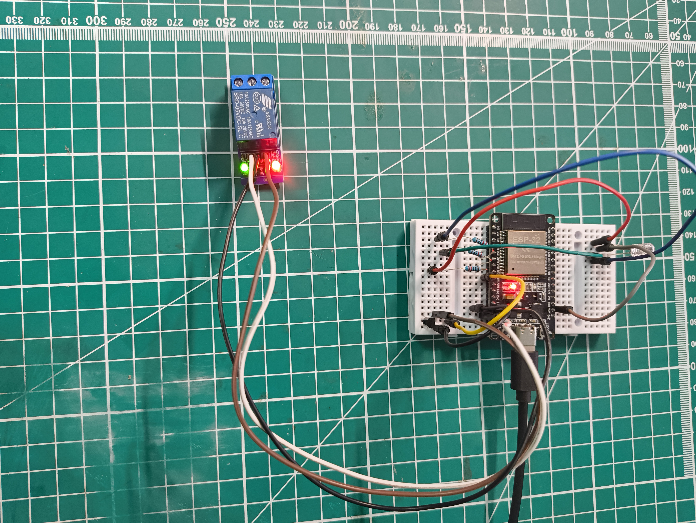
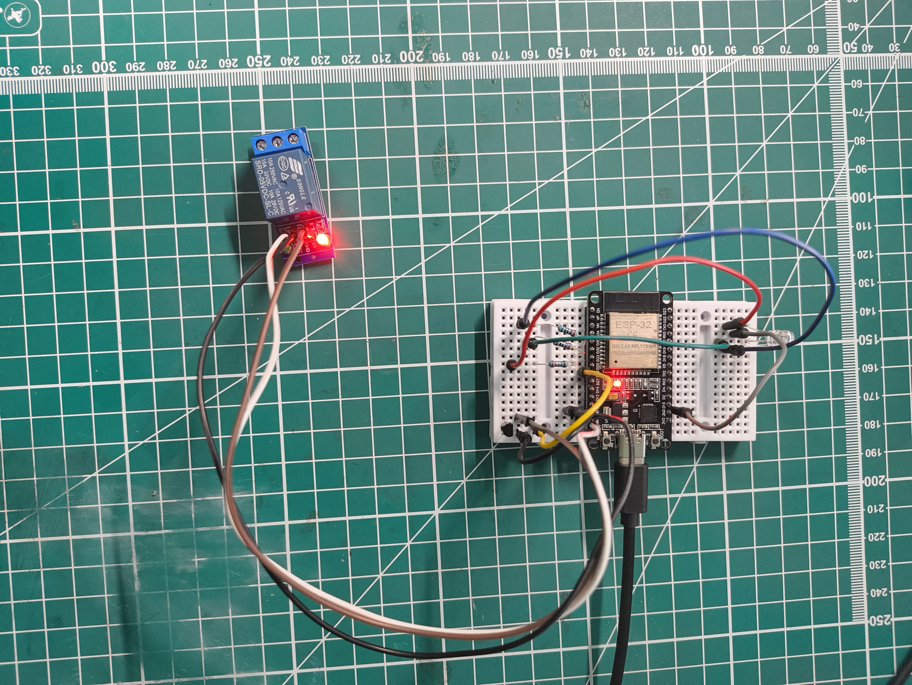
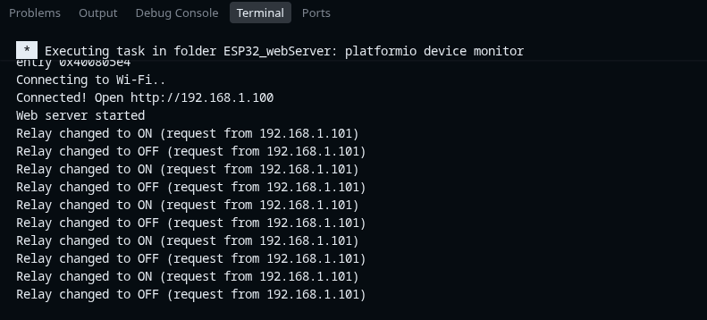

# ESP32 Web Server — LED + Relay + RGB Control

Control an ESP32 DevKit over your local Wi-Fi network from any phone or computer browser.
The ESP32 hosts a small web server (port 80) with buttons for the on-board LED, a 5 V relay module, and a common-cathode RGB LED. Every action is logged to the Serial Monitor together with the IP address of the client that triggered it.



## Features

- Web UI with three control cards: on-board LED, relay, RGB (per-channel + all on/off)
- REST-like GET routes for every action (easy to call from scripts/automation)
- Serial logging of every state change, including the requester's IP
- Safe relay driving through an NPN transistor (required for this relay module — see [Why a transistor is needed](#why-a-transistor-is-needed))
- Common-anode RGB support via one config flag
- Wi-Fi credentials kept out of git (`include/secrets.h` is ignored; commit only the template)

## Hardware

| Item | Qty | Notes |
| --- | --- | --- |
| ESP32 DevKit V1 (Type-C) | 1 | Tested board, CP2102 USB-serial |
| 5 V 1-channel relay module, transistor-drive (no optocoupler, no JD-VCC jumper) | 1 | Blue Songle SRD-05VDC-SL-C, red PWR LED + green SW LED |
| Common-cathode RGB LED, 4 pins | 1 | Longest (middle) pin → GND |
| 220 Ω resistor | 3 | One in series with each R/G/B pin |
| NPN transistor (2N2222 / BC547 / S8050) | 1 | Relay driver — **mandatory** (see below) |
| 1 kΩ resistor (1 k–4.7 k works) | 1 | ESP32 GPIO → transistor base |
| Data-capable USB-C cable | 1 | Charge-only cables cannot upload |

## Wiring

> Unplug USB before (re)wiring.

### Relay (via NPN transistor)

| Relay pin | Connect to |
| --- | --- |
| VCC | VU / VIN (5 V from board USB) |
| GND | GND (common ground rail) |
| IN | Transistor **collector (C)** — not directly to the ESP32 |

| Transistor pin | Connect to |
| --- | --- |
| Emitter (E) | GND |
| Base (B) | 1 kΩ resistor → GPIO 26 |

How it works: web ON → GPIO 26 HIGH → transistor conducts → pulls IN to ~0 V → relay clicks ON (green SW LED lights). Web OFF → transistor stops → IN floats back to 5 V → relay OFF. Bonus: at boot GPIO 26 floats / transistor stays off, so the relay is always OFF on boot.

**Measured at IN vs GND:** OFF ≈ 5 V, ON ≈ 0.2 V.

### RGB LED (common cathode)

| RGB pin | Connect to |
| --- | --- |
| Middle (longest) | GND |
| R | 220 Ω → GPIO 25 |
| G | 220 Ω → GPIO 33 |
| B | 220 Ω → GPIO 32 |

Logic: HIGH = on, LOW = off. Never connect an LED pin without its resistor.
For a **common-anode** RGB LED: middle pin → 3.3 V (never 5 V directly) and set `RGB_COMMON_ANODE = true` in `src/main.cpp`.

### Pin summary

| Function | GPIO | Notes |
| --- | --- | --- |
| On-board LED (status) | 2 | Kept as status LED |
| Relay (via transistor) | 26 | Active-HIGH from the ESP32 side |
| RGB R / G / B | 25 / 33 / 32 | Via 220 Ω each |
| Avoid | 34–39 | Input-only, cannot drive outputs |

## Hardware photos

Relay **ON** (green SW LED lit, red PWR LED lit):



Relay **OFF** (only red PWR LED lit):



## Software setup

Requirements: [VS Code](https://code.visualstudio.com/) + [PlatformIO extension](https://platformio.org/), USB driver for CP2102.

`platformio.ini`:

```ini
[env:esp32dev]
platform = espressif32
board = esp32dev
framework = arduino
monitor_speed = 115200
```

1. Clone the repo and open it in VS Code (PlatformIO).
2. Create your Wi-Fi credentials file (never committed):
   ```sh
   cp include/secrets.h.example include/secrets.h
   ```
   then edit `include/secrets.h` with your 2.4 GHz SSID/password:
   ```cpp
   const char *WIFI_SSID = "YOUR_WIFI_SSID";
   const char *WIFI_PASSWORD = "YOUR_WIFI_PASSWORD";
   ```
3. Plug in the board over USB-C and select the ESP32 port (e.g. `/dev/ttyUSB1` on Linux — note: `/dev/ttyACM0` on this machine was an audio device, not the board).
4. Upload: PlatformIO **Upload**. If upload fails, hold **BOOT** while the upload starts.
5. Open the Serial Monitor at **115200** (must match `Serial.begin(115200)`), press **EN** once to restart, and wait for:
   ```
   Connecting to Wi-Fi...
   Connected! Open http://192.168.x.x
   Web server started
   ```
6. On a phone/computer on the **same Wi-Fi network**, open `http://<shown-IP>`.
7. Test in order: on-board LED → RGB one color at a time → relay **with no load** (listen for the click, watch the green SW LED).

## Web routes

| Action | Route |
| --- | --- |
| On-board LED on / off | `/on`, `/off` |
| Relay on / off | `/relay/on`, `/relay/off` |
| RGB red on / off | `/rgb/r/on`, `/rgb/r/off` |
| RGB green on / off | `/rgb/g/on`, `/rgb/g/off` |
| RGB blue on / off | `/rgb/b/on`, `/rgb/b/off` |
| RGB all on / off | `/rgb/all/on`, `/rgb/all/off` |
| Status page | `/` |

Example serial log:



```
Connecting to Wi-Fi...
Connected! Open http://192.168.x.x
Web server started
LED changed to ON (request from 192.168.x.x)
LED already ON (request from 192.168.x.x)
Relay changed to ON (request from 192.168.x.x)
RGB all on -> R:ON G:ON B:ON (request from 192.168.x.x)
```

## Configuration (`src/main.cpp`)

```cpp
constexpr uint8_t LED_PIN = 2;
constexpr uint8_t RELAY_PIN = 26;
constexpr bool RELAY_ACTIVE_LOW = false; // false = driven via NPN transistor (Active HIGH from ESP32)
constexpr uint8_t RGB_R_PIN = 25;
constexpr uint8_t RGB_G_PIN = 33;
constexpr uint8_t RGB_B_PIN = 32;
constexpr bool RGB_COMMON_ANODE = false; // true for common-anode RGB
```

## Why a transistor is needed

This relay module references its control signal against 5 V. The ESP32's 3.3 V HIGH cannot switch it off, so driving `IN` directly from a GPIO leaves the green SW LED stuck on with no click — even though the log prints `changed to ON/OFF`. The NPN transistor translates the 3.3 V GPIO into a proper 5 V-referenced signal. Quick check: unplug `IN` and leave it floating — if the SW LED goes off, this is your problem and the transistor driver is the fix.

## Troubleshooting

| Symptom | Cause | Fix |
| --- | --- | --- |
| Serial Monitor won't open | A stale monitor process still holds the port | Close it with `Ctrl+C`; keep only one monitor open (or kill the stuck process) |
| Garbled serial text at correct 115200 baud | Serial messages contained Thai (UTF-8) text the terminal decoded as Latin-1 | Serial messages are now English-only (the web page may stay in Thai); short garbage right after pressing EN is the normal bootloader log |
| Requester IP missing/garbage in log | Dangling pointer: `const char*` stored from a temporary `String` (`...toString().c_str()`) that was destroyed at end of line | Store `IPAddress clientIp = server.client().remoteIP();` and call `.toString().c_str()` directly inside `Serial.printf` |
| Relay SW LED stuck on, no click, but log changes | 3.3 V GPIO can't drive this 5 V-referenced module | Drive via NPN transistor (see wiring) and set `RELAY_ACTIVE_LOW = false` |
| Upload fails | Board not in download mode | Hold **BOOT** while the upload starts |

## Safety

- Always test the relay **with no load first** (click + SW LED).
- For 220 V mains: wire AC **last**, never touch the board while plugged into mains, enclose it in an isolated box, check the relay current rating, and use the correct NO/COM/NC terminals (NO = normally open).
- If the ESP32 reboots when the relay switches, your USB supply is too weak — power the relay side from a separate 5 V adapter with grounds tied together.
- Never drive LEDs without series resistors — excess current can destroy GPIO pins.

## Project structure

```
ESP32_webServer/
├── src/
│   ├── main.cpp          # Firmware: Wi-Fi, web server, LED/relay/RGB logic
│   └── assets/           # Photos/screenshots used by this README
├── include/
│   ├── secrets.h         # Your Wi-Fi credentials (git-ignored, never pushed)
│   └── secrets.h.example # Template — copy to secrets.h and fill in
├── platformio.ini        # esp32dev / Arduino / 115200 monitor
└── summary.txt           # Original Thai-language build notes (local reference)
```

## Possible extensions

- RGB dimming/color mixing with PWM (`ledc`) instead of `digitalWrite`
- Single toggle button + log page visits to `/`
- Add a sensor (e.g. DHT22/BME280) and show readings on the same page
- MQTT to Node-RED / Home Assistant for access outside the LAN (this web UI only works on the local network)
